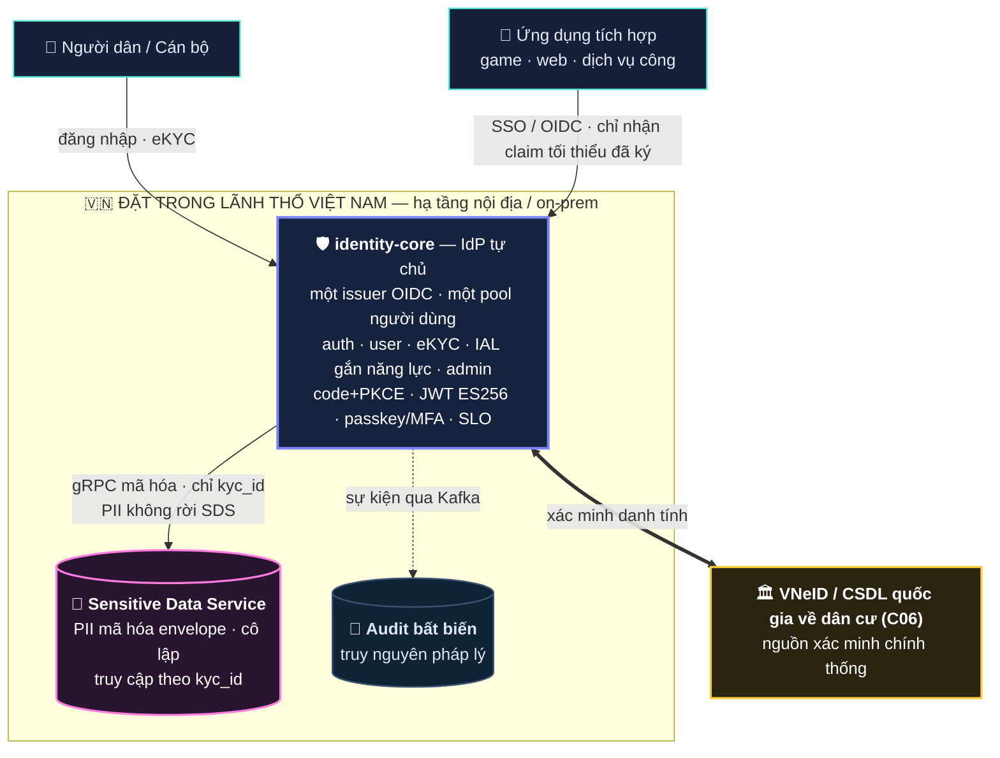

# Định danh trên Không gian mạng — Bản trình bày giải pháp

**Tác giả:** Thành Lê Phước

**Vai trò trình bày:** Solution Architect · **Ngày:** 2026-06-09 · **Loại:** Tóm tắt điều hành (Executive Brief)

> **Một câu:** Nền tảng định danh số **"Make in Vietnam"** — gộp **xác minh danh tính (eKYC)** và **đăng nhập một lần (SSO/OpenID Connect)** trên một hạ tầng **chủ quyền, an ninh-trên-hết, tuân thủ Đề án 06**, sẵn sàng phục vụ quy mô quốc gia.

---

## 1. Vì sao là bây giờ

- **Đề án 06 + Luật Căn cước 2023 + VNeID** đã đặt nền cho định danh số toàn dân — nhu cầu thực tế: *một danh tính, đăng nhập & xác minh cho mọi dịch vụ*.
- Phần lớn nền tảng định danh hiện hữu **phụ thuộc nước ngoài** (Keycloak, cloud ngoại, CA ngoại) → rủi ro **chủ quyền và an ninh dữ liệu công dân**.
- → Cần một **nền tảng định danh chủ quyền** (tự chủ, đặt trong nước) **tích hợp VNeID** làm nguồn xác minh cấp cao — phục vụ **khu vực công & doanh nghiệp**, đạt chuẩn cấp nhà nước (ADR-0015 · Kịch bản B).

## 2. Giải pháp trong một hình

**Một pool người dùng · một issuer · nhiều ứng dụng.** Dữ liệu nhạy cảm tách hẳn sang dịch vụ mã hóa cô lập; danh tính được neo vào nguồn quốc gia VNeID.

## 3. Bốn trụ giá trị — vì sao thuyết phục

| Trụ cột | Cam kết | Cách hiện thực |
|---|---|---|
| 🇻🇳 **Chủ quyền số** | Dữ liệu & hạ tầng **trong lãnh thổ VN**, không phụ thuộc nước ngoài | Cloud nội địa/on-prem; OSS tự-host; PKI quốc gia (NEAC/Ban Cơ yếu) |
| 🔐 **An ninh trên hết** | PII **không bao giờ** ở dạng thô, kể cả khi DB bị xâm nhập | Dịch vụ SDS cô lập + mã hóa envelope (AES-256-GCM, khóa phân cấp có version) |
| 🛠️ **Tự chủ công nghệ** | Làm chủ hoàn toàn lõi định danh, không khóa nhà cung cấp | Tự viết IdP (dùng thư viện token đã kiểm chứng), không Keycloak |
| ⚖️ **Tuân thủ & chuẩn** | Hợp pháp lý VN + theo chuẩn định danh quốc tế | Đề án 06, NĐ13/2023, Luật ANM, Luật Căn cước; OAuth2/OIDC chuẩn |

## 4. Năng lực chính

- **SSO/OIDC chuẩn quốc tế:** Authorization Code + PKCE, token JWT ES256 + JWKS, refresh rotation chống đánh cắp, đăng xuất toàn cục (SLO), **passkey/FIDO + MFA** (đăng nhập không mật khẩu, chống phishing).
- **eKYC + IAL "gắn năng lực":** mức định danh (IAL1→IAL3, cao nhất qua VNeID) **mở khóa tính năng** — học trực tiếp từ UAE PASS.
- **Tiết lộ tối thiểu:** ứng dụng chỉ nhận *kết luận đã ký* (vd "đủ 18 tuổi", "đã định danh") — **chứng minh tính đúng mà không lộ dữ liệu gốc**; mỗi ứng dụng một mã ẩn danh riêng (chống đối chiếu người dùng).
- **Truy nguyên pháp lý:** audit bất biến, sẵn sàng phục vụ điều tra/giám sát hợp pháp.
- **Sẵn sàng quy mô quốc gia:** kiến trúc stateless, mở rộng ngang không phải sửa thiết kế.

## 5. Chủ quyền & tuân thủ — điểm nhấn cho hệ thống nhà nước

- **Trong nước 100%:** dữ liệu, khóa, log, hạ tầng đều đặt tại VN; **không** Cloudflare/AWS/CA nước ngoài.
- **Neo nguồn quốc gia:** VNeID / CSDL dân cư (C06) là nguồn xác minh chính thống.
- **Mật mã & chữ ký số cấp nhà nước:** khóa trong HSM nội địa (cân nhắc **Ban Cơ yếu**); chữ ký số pháp lý chuỗi tới **CA quốc gia (NEAC)**.
- **An toàn theo cấp độ:** thiết kế theo NĐ85/2016 + TCVN 11930 (định danh dân cư ~cấp 4–5), kèm SOC + kiểm định độc lập.
- **Kiểm toán được:** stack mã nguồn mở, tự vận hành — cơ quan an ninh thẩm định được toàn bộ.

## 6. Học hỏi quốc tế, giữ chủ quyền

Đã đối chuẩn (benchmark) hai mô hình hàng đầu:
- **UAE PASS** (tập trung) — học *level-of-assurance gắn năng lực*, đăng xuất toàn cục, kho tài liệu số.
- **NDA Key** (phi tập trung / ZKP) — học hướng *ví số & bằng chứng không-tiết-lộ*.

→ **Chọn mô hình tập trung** (kiểm soát rõ ràng, vận hành minh bạch, hợp vai trò cơ quan nhà nước); giữ **ZKP/VC/ví số** cho lộ trình — đi chắc trước, mở rộng sau.

## 7. Lộ trình triển khai

| Giai đoạn | Nội dung | Kết quả |
|---|---|---|
| **MVP** | OIDC/SSO + eKYC (VNeID+thương mại) + IAL + passkey/MFA + audit | Một danh tính, đăng nhập mọi ứng dụng, định danh có bảo chứng |
| **Gần** | Tiết lộ tối thiểu nâng cao (SD-JWT), thêm provider, SDK tích hợp | Quyền riêng tư mạnh hơn, mở rộng đối tác nhanh |
| **Tầm nhìn** | Chữ ký số pháp lý (CA quốc gia), ví số / VC / ZKP, định danh game | Hệ sinh thái định danh số toàn diện |

## 8. Thách thức then chốt & cách kiểm soát

> Đã nhận diện các **yếu tố quyết định thành công** và có kế hoạch kiểm soát cụ thể — dấu hiệu trưởng thành của thiết kế, không phải điểm yếu.

| Thách thức then chốt | Cách kiểm soát |
|---|---|
| **Quyền tích hợp nguồn quốc gia** (VNeID/CSDL dân cư) & mandate vận hành | Bảo đảm **sponsor + MOU** và tiếp cận **C06** từ sớm; **MVP chạy độc lập** qua provider thương mại → không phụ thuộc một giấy phép chưa có |
| **An toàn lõi định danh** (IdP tự viết) | Thư viện token đã kiểm chứng + **OIDC conformance test** + **pentest & audit độc lập** trước go-live |
| **Bảo vệ PII & kiểm định ATTT cấp độ 4–5** | SDS cô lập + **HSM**; thiết kế theo NĐ85/2016 + TCVN 11930; **khởi động kiểm định từ sớm** |
| **Sẵn sàng (mô hình tập trung = SPOF)** | DR + đa-DC + degrade graceful (đăng nhập vẫn chạy khi eKYC chậm) |

Chi tiết & mốc **go/no-go**: xem `risk-register.md`.

## 9. Vì sao tin được — kỷ luật kỹ thuật

- **14 ADR** ghi lại mọi quyết định kiến trúc kèm phương án đã cân nhắc (minh bạch, kiểm chứng được).
- Mô tả theo chuẩn **arc42**, thiết kế **DDD/Clean Architecture**, phát triển **TDD**.
- **Ubiquitous Language** thống nhất thuật ngữ; tài liệu sống + trang trực quan hóa.
- Tech stack proven, OSS, tự-host: **Go · PostgreSQL · Redis · Kafka · SigNoz/OpenTelemetry**.

> **Trạng thái:** đã **hoàn tất thiết kế kiến trúc & quyết định công nghệ**, sẵn sàng vào giai đoạn triển khai theo lộ trình mảnh nhỏ, có kiểm thử.

## 10. Kết luận

Đây không chỉ là một hệ đăng nhập — mà là **nền tảng định danh số chủ quyền (Make in Vietnam)**: an toàn ở mức cơ quan nhà nước, tự chủ về công nghệ, tuân thủ pháp lý, tích hợp VNeID, **sẵn sàng cho khu vực công & doanh nghiệp** và mở đường tới chữ ký số & ví danh tính. **Nền móng đã sẵn sàng — việc còn lại là triển khai.**
